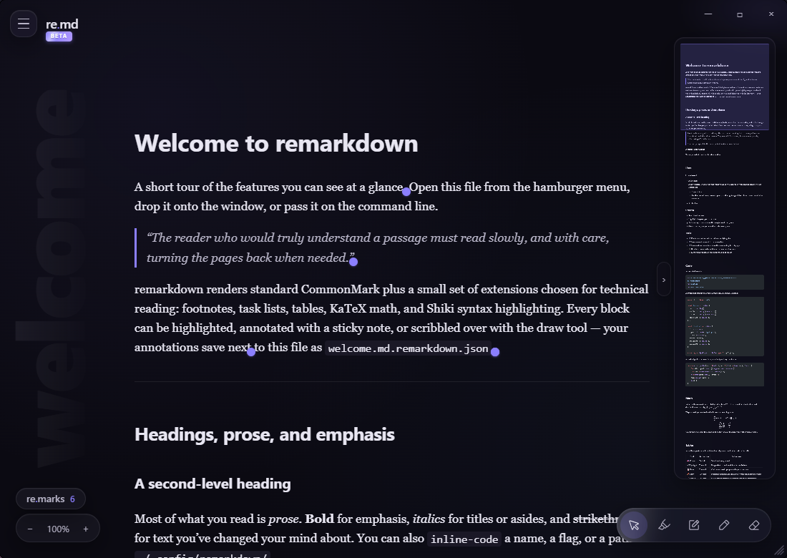
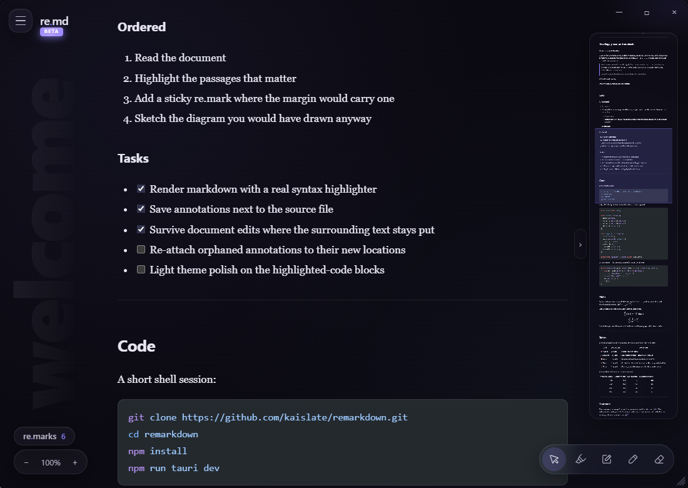
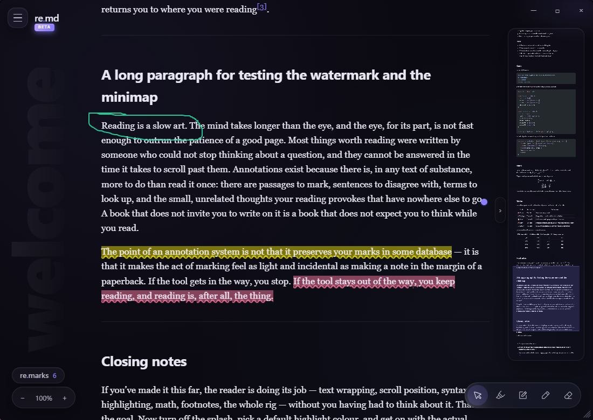
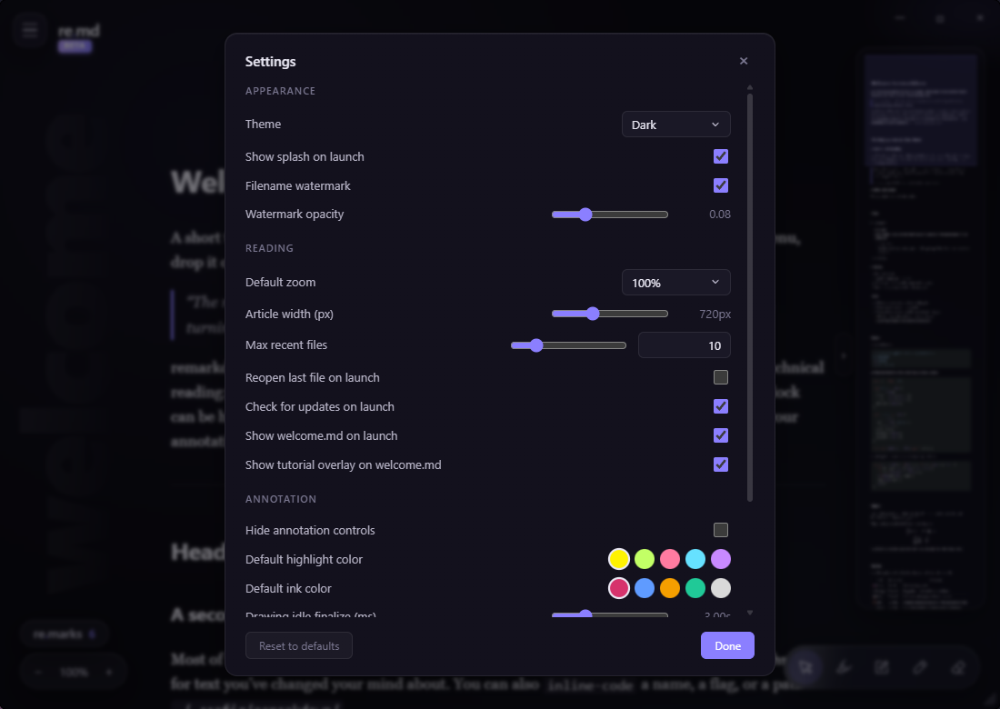

<div align="center">
  
</div>

> **A desktop reader for markdown documents with PDF-style annotations** — highlight, leave a re.mark, and doodle on top of your docs. Annotations save as a human-readable JSON sidecar next to the source file.

<div align="center">

| | |
|:---:|:---:|
|  |  |
| <sub>**Reading view** — vertical watermark, syntax-highlighted article, right-gutter minimap, animated BETA pin under the wordmark.</sub> | <sub>**Navigation, checkboxes & code** — drag in the right-gutter minimap to jump anywhere in long documents; task-list `- [ ]` items render as live checkboxes; fenced code blocks pick up real per-language Shiki theming (Rust shown here).</sub> |
|  |  |
| <sub>**Annotate freely** — highlight passages in 5 preset colors, drop re.marks anchored to a single word with inline popovers, and doodle on top of the text with the freehand draw tool.</sub> | <sub>**Settings panel** — 18 preferences across appearance, reading, annotation, and updates.</sub> |

</div>


---

## 🎉 0.5.0 Beta — Public Beta Launch

**remarkdown 0.5.0-beta is the first public beta.** It ships every v1 reader + annotation feature, the full error-recovery matrix, a hand-drawn welcome tutorial, the new **re.marks side panel**, and — for the first time — **in-app auto-update** so future betas land without you having to manually reinstall. Stable enough for daily reading; bug reports very welcome.

> ⚠️ **If you're running a pre-beta build (0.4.x or earlier):** auto-update wasn't shipped yet, so your installed copy can't pull this beta on its own. **Download the 0.5.0-beta installer from the [Releases page](../../releases/latest) and run it once** — every release after this one will arrive automatically via the in-app updater.

---

## ⬇️ Download

Pre-built Windows installers are published with each tagged release. Grab the latest from the **[Releases page](../../releases/latest)**:

- `remarkdown_<version>_x64-setup.exe` — NSIS installer (recommended)
- *MSI installers return for stable releases — beta builds are NSIS-only because Windows MSI's version field doesn't accept alphanumeric pre-release tags like `-beta`.*

Already installed? Open **Hamburger menu → Check for updates…** to grab the next release without leaving the app.

---

## ✨ Why remarkdown?

When you're reading a technical spec, a paper, or a book chapter in markdown, you often want to **highlight key passages**, **scribble in the margins**, and **leave re.marks** — the same mental model you'd use with a paper book or a PDF. Most markdown viewers are read-only, and most annotation tools require converting to PDF first.

remarkdown reads plain markdown from disk, renders it in a clean dark UI, and lets you annotate on top. Your annotations save **alongside** the source file as a plain-text JSON sidecar — so they stay with your notes, survive document edits where possible, and can be read back by any tool (including LLMs) without the original document loaded.

---

## 🎨 Features

### Annotation
- **🖍 Highlights** in 5 preset colors, rendered via the CSS Custom Highlight API — no DOM mutation, handles overlaps cleanly
- **📝 re.marks** (sticky-note style) anchored to the right margin of the chosen word, with click-off-to-close popovers and punctuation-aware word boundary detection
- **📋 re.marks side panel** — pop-up pill above the zoom controls opens a glass-styled list of every re.mark with **N sentences of surrounding context** (configurable 1-5 sentences, optional paragraph-stop). Click an entry to jump.
- **✏️ Freehand drawings** with SVG strokes, 5 ink colors, auto-finalized after 3 seconds of idle
- **🧹 Eraser tool** — single-click delete for any highlight, re.mark, or drawing without confirmation
- **🔎 Robust anchoring** — W3C-style text-quote selectors with fast path (matching block) and slow path (cross-block similarity scoring); annotations re-resolve after edits where possible
- **👻 Orphan panel** — when an edit moves a phrase beyond recognition, the annotation goes to an "orphaned" list instead of being lost

### Reading
- **📂 Drag-drop** any `.md` file from Explorer onto the window to open it
- **🕘 Open Recent** menu with missing-file detection and grey-out
- **🗺 VS Code-style minimap** in the right gutter for long-document navigation
- **🔍 Zoom** with `Ctrl +` / `Ctrl -` / `Ctrl 0` — scales the entire article (and minimap) via a single CSS variable
- **🌓 Dark or light liquid-glass UI** with a frameless custom title bar, hamburger menu, and bottom tool rail — designed to disappear while you read
- **🪞 Vertical filename watermark** in the left margin (extreme size, low opacity, fades toward the article column)

### First-run experience
- **👋 Welcome document** opens automatically the first time you launch (toggleable hint in the corner to skip future launches)
- **📍 Hand-drawn tutorial overlay** — six arrows + a bracket point at every piece of chrome the first time you see the welcome doc; dismiss for the session or hide forever
- **🎬 Animated splash** with a re.md → remarkdown morph and an animated BETA pin

### Window chrome
- **🖱 Hamburger hover morph** — the wordmark animates from `re.md` → `remarkdown` whenever you hover the menu button (same choreography as the splash)
- **🔧 Bottom-right resize grip** — drag to resize, **double-click to reset to the default 1100×780**; double-click the title bar to toggle maximize
- **🏷 Animated BETA pin** under the wordmark and on the splash, with glow-pulse + gradient drift + diagonal shine; auto-hides at 1.0+ stable

### Auto-update
- **⬆️ In-app updater** with manual "Check for updates…" in the hamburger menu and an optional auto-check on launch (Settings → off by default for paranoid users)
- **🔐 Ed25519-signed installers** — every update verifies its signature against the public key baked into the app before installing; tampered installers are refused
- **📦 GitHub Releases as the distribution channel** — manifest at `/releases/latest/download/latest.json` is what your installed copy polls

### Settings
- **⚙️ Settings panel** (hamburger → Settings…) persists 18 user preferences to `settings.json` in the OS app-data dir
- **Appearance** — dark/light theme, splash on/off, watermark on/off, watermark opacity
- **Reading** — default zoom, article column width, max recent files (slider + typeable badge), reopen-last-file on launch, hide annotation chrome, show welcome on launch, show tutorial overlay
- **Annotation** — default highlight color, default ink color, drawing idle-finalize duration, re.marks sentence-context count + paragraph-stop
- **Save behaviour** — sidecar write debounce
- **Updates** — auto-check on launch on/off
- All settings apply live; "Reset to defaults" restores everything in one click

### Storage & resilience
- **💾 Atomic sidecar writes** with configurable debounced saves; retry with exponential backoff on write failures; synchronous flush on window close
- **🛡 Error matrix** — UTF-8 toast, corrupt-sidecar backup modal, write-retry banner, 2 MB size warning
- **🧪 Battle-tested** — 320+ Vitest unit/component tests, 6 Rust tests, 6 Playwright E2E scenarios, zero `svelte-check` warnings

---

## 🎛 Tools

| Tool | Activation | Behavior |
|------|-----------|----------|
| 🎯 **Cursor** | Default | Normal text selection; copy works |
| 🖍 **Highlight** | Tool rail | Drag-select text → highlight in current color. Right-click an existing highlight → Delete |
| 📝 **re.mark** | Tool rail | Click a word → accent pin pinned to that word's end with an inline popover. Click the **re.marks** pill above the zoom controls to browse every annotation with surrounding sentence context. |
| ✏️ **Draw** | Tool rail | Freehand stroke capture. 3s idle or tool-change finalizes. Right-click an existing drawing → Delete |
| 🧹 **Eraser** | Tool rail | Click any annotation to delete it instantly — no confirmation |

Color strip appears above the rail when **Highlight** or **Draw** is active (5 presets each).

---

## ⌨️ Keyboard shortcuts

| Shortcut | Action |
|----------|--------|
| `Ctrl +` / `Ctrl =` | Zoom in |
| `Ctrl -` | Zoom out |
| `Ctrl 0` | Reset zoom |
| `Esc` | Close popover / cancel selection / exit reader mode |
| `?` | Show or hide the welcome tutorial overlay |
| `1` / `2` / `3` / `4` / `5` | Switch to Cursor / Highlight / re.mark / Draw / Eraser |
| Double-click title bar | Toggle maximize |
| Double-click bottom-right corner | Reset window to 1100×780 |

---

## 💡 How the sidecar works

For every markdown file `foo.md`, remarkdown writes annotations to a sibling file `foo.md.remarkdown.json`:

```jsonc
{
  "_comment": "remarkdown annotations for: foo.md",
  "$schema": "remarkdown/v1",
  "document": {
    "path": "foo.md",
    "sha256": "7ac1bc…",
    "lastSeenBytes": 4821
  },
  "annotations": [
    {
      "id": "01HP8XYZ…",
      "type": "highlight",
      "color": "#ffd25a",
      "anchor": {
        "text": "must read slowly, and with care",
        "prefix": "The reader who would truly understand ",
        "suffix": ", turning the pages back when needed.",
        "blockHint": "p:3"
      },
      "createdAt": "2026-04-21T14:32:00Z",
      "updatedAt": "2026-04-21T14:32:00Z"
    }
  ]
}
```

The file is git-friendly, human-editable, and semantically rich enough for an LLM to understand every annotation without the source document loaded.

---

## 🚀 Getting started

### Prerequisites

- **Node.js 20+**
- **Rust** (stable toolchain)
- Tauri 2 platform prerequisites: https://v2.tauri.app/start/prerequisites/

### Run in development

```bash
git clone https://github.com/kaislate/remarkdown.git
cd remarkdown
npm install
npm run tauri dev
```

> ⏱ First cold build compiles the Rust toolchain + Tauri dependencies — expect **3–8 minutes**. Subsequent launches are ~5 seconds.

### Build a release installer

```bash
npm run tauri build
```

Produces a signed NSIS installer in `src-tauri/target/release/bundle/nsis/`. Cutting a release with the in-app updater enabled requires the Ed25519 signing key — see [RELEASING.md](RELEASING.md) for the full process.

---

## 🗺 Roadmap

### ✅ 0.5.0 Beta (current)
- Reader MVP with Shiki syntax highlighting + KaTeX math + footnotes + task lists + tables + relative images
- All four annotation types (highlight, re.mark, drawing, eraser) with save/load round-trip
- **re.marks side panel** with configurable sentence-context (1-5 sentences, paragraph-stop)
- Anchoring with orphan detection and panel
- Full error matrix and resilience: UTF-8 toast, corrupt-sidecar backup modal, write-retry banner, 2 MB size warning
- Drag-and-drop file opening, Open Recent menu, minimap, zoom, frameless window, splash screen
- 18-setting Settings panel with persistent preferences and live apply
- Dark and light themes
- Vertical filename watermark in the left margin
- **Hand-drawn welcome tutorial** overlay with rough.js arrows, dismissible per-session or forever
- **In-app auto-update** with manual + auto-check, Ed25519-signed installers
- **Animated BETA pin** + hamburger hover morph + bottom-right resize grip with double-click reset
- Playwright E2E coverage of the spec scenarios
- 320+ Vitest tests, 6 Rust tests, 0 svelte-check warnings

### 🔮 Post-beta (deferred)
- **Re-attach** orphaned annotations to their new locations
- **File watcher** for external edits while reading
- **Undo/redo** action log
- **Per-doc asset protocol scope** tightening (security hardening)
- **Mermaid** diagrams, Obsidian-style callouts, wiki-links
- **PDF/HTML export** with baked-in annotations
- **Cross-document commands** — *"summarize highlights across these N files"*
- **Pre-release channel** — opt-in to receive next-version betas via the auto-updater
- **Collaboration** — real-time sync / multi-user annotations

---

## 🧪 Testing

```bash
npm test              # 320+ Vitest unit + component tests
npm run check         # svelte-check (0 errors, 0 warnings)
npm run test:e2e      # 6 Playwright end-to-end scenarios
cd src-tauri && cargo test   # 6 Rust tests
```

---

## 🛠 Tech stack

| Layer | Choice | Reason |
|-------|--------|--------|
| Shell | **Tauri 2.x** | ~5–10 MB installer, native file dialogs, Rust host, auto-updating WebView2 on Windows |
| Updater | **tauri-plugin-updater** + minisign Ed25519 | Signed installer verification against an in-app pubkey |
| UI framework | **Svelte 5** (runes) + Vite | Compiled away, small runtime, clean reactive primitives |
| Markdown | **markdown-it** + footnote + task-lists + KaTeX | Mature, plugin-rich, easy to extend |
| Syntax highlight | **Shiki** 1.x (WASM, github-dark) | Real VS Code themes, dark-friendly |
| Math | **KaTeX** via `@vscode/markdown-it-katex` | Fast, no server |
| Anchoring | W3C-style **text-quote selector** | Robust to edits, graceful orphaning |
| Hand-drawn UI | **rough.js** | Sketchy/jittery vector strokes for the tutorial arrows |
| Validation | **Zod** | Runtime-validated loads, typed TS output |
| Highlights rendering | **CSS Custom Highlight API** | No DOM mutation, browser-native overlap handling |
| Tests | **Vitest** + `@testing-library/svelte` + **Playwright** | Unit / component / e2e |

---

## 📁 Project layout

```
remarkdown/
├── src/                     # Svelte 5 frontend
│   ├── lib/                 # Pure TS modules (anchoring, renderer, save, schema, …)
│   ├── components/          # Svelte components (Viewer, ToolRail, layers, modals, …)
│   ├── stores/              # Reactive state (doc, annots, tool, toasts, modals, …)
│   └── styles/              # Theme tokens (dark + light) + glass mixins + CSS highlight rules
├── src-tauri/               # Rust host
│   ├── capabilities/        # Tauri capability allowlists
│   └── src/                 # Invoke commands, atomic sidecar writes, recent-files persistence
├── scripts/                 # Build helpers (latest.json manifest generator)
├── tests/
│   ├── unit/                # Vitest unit tests
│   ├── component/           # @testing-library/svelte component tests
│   └── e2e/                 # Playwright end-to-end + support/
├── RELEASING.md             # End-to-end release/sign/publish process
└── README.md                # This file
```

---

## 🤝 Contributing

remarkdown is a personal project right now. If you find a bug or want a feature, please open an issue **before** opening a PR so we can talk about scope.

---

## 📜 License

TBD. Will settle on a license before a stable `v1.0` tag ships.

---

<div align="center">

🖍 · 📝 · ✏️ · 🧹

*Read well. Mark well. Keep your thoughts where your source lives.*

</div>
