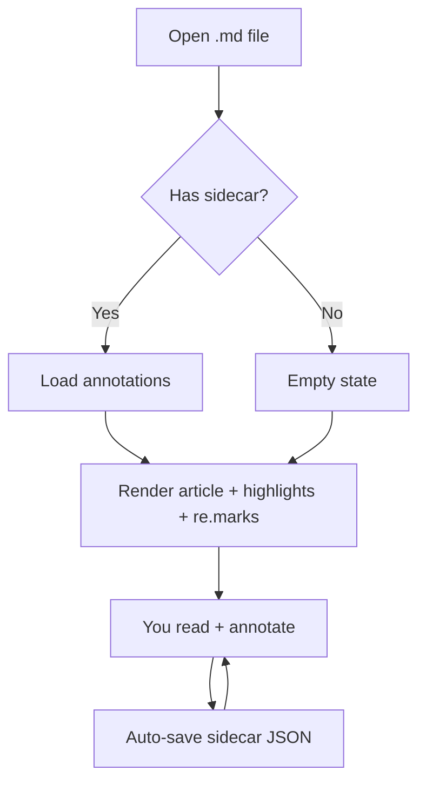
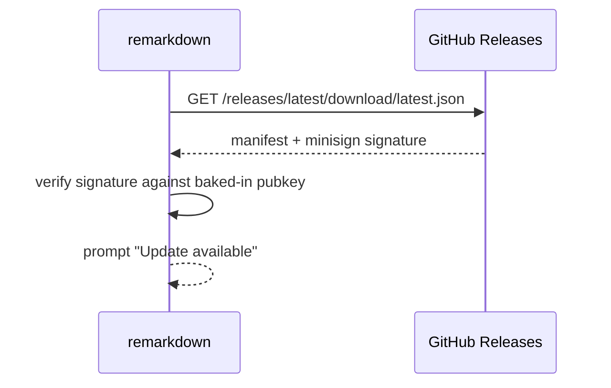

# Welcome to remarkdown

A short tour of the features you can see at a glance. Open this file from the hamburger menu, drop it onto the window, or pass it on the command line.

> *"The reader who would truly understand a passage must read slowly, and with care, turning the pages back when needed."*

remarkdown renders standard CommonMark plus a small set of extensions chosen for technical reading: footnotes, task lists, tables, KaTeX math, and Shiki syntax highlighting. Every block can be highlighted, annotated with a sticky note, or scribbled over with the draw tool — your annotations save next to this file as `welcome.md.remarkdown.json`.

---

## Headings, prose, and emphasis

### A second-level heading

Most of what you read is *prose*. **Bold** for emphasis, *italics* for titles or asides, and ~~strikethrough~~ for text you've changed your mind about. You can also `inline-code` a name, a flag, or a path: `~/.config/remarkdown/`.

> Block quotes are styled to recede slightly from the surrounding text — the way a footnote in a printed book sits below the rule. They're useful for citation, for a momentary aside, or for setting off a definition.
>
> A second paragraph in the same quote inherits the same indent.

#### A fourth-level heading

For very small distinctions inside a section.

---

## Lists

### Unordered

- A first item
- A second item, with a longer line that wraps so you can see how the indent behaves on the second line
  - A nested item
  - Another nested item, also wrapping past the right edge of the column when the window is narrow
- A third item

### Ordered

1. Read the document
2. Highlight the passages that matter
3. Add a sticky re.mark where the margin would carry one
4. Sketch the diagram you would have drawn anyway

### Tasks

- [x] Render markdown with a real syntax highlighter
- [x] Save annotations next to the source file
- [x] Survive document edits where the surrounding text stays put
- [ ] Re-attach orphaned annotations to their new locations
- [ ] Light theme polish on the highlighted-code blocks

---

## Code

A short shell session:

```bash
git clone https://github.com/kaislate/remarkdown.git
cd remarkdown
npm install
npm run tauri dev
```

A TypeScript snippet showing how the sidecar schema is parsed:

```ts
import { z } from 'zod';

const Anchor = z.object({
  text: z.string(),
  prefix: z.string().optional(),
  suffix: z.string().optional(),
  blockHint: z.string(),
});

const Highlight = z.object({
  id: z.string(),
  type: z.literal('highlight'),
  color: z.string(),
  anchor: Anchor,
  createdAt: z.string(),
  updatedAt: z.string(),
});

export type Highlight = z.infer<typeof Highlight>;
```

A Rust snippet — the same idea, atomically writing the sidecar:

```rust
pub fn atomic_write(path: &Path, bytes: &[u8]) -> Result<(), Error> {
    let dir = path.parent().ok_or(Error::NoParent)?;
    let tmp = NamedTempFile::new_in(dir)?;
    fs::write(tmp.path(), bytes)?;
    tmp.persist(path)?;
    Ok(())
}
```

---

## Diagrams

Fenced code blocks tagged `mermaid` render as actual SVG diagrams. The same source language Obsidian, GitHub, Notion, and VS Code understand — flowcharts, sequence diagrams, state machines, and more.



A sequence diagram of the auto-update pipeline that brought you this build:



Bad mermaid syntax falls back to a visible error message inside the diagram block — never crashes the article.

---

## Callouts

Blockquotes prefixed with a `[!type]` directive on the first line render as themed boxes with an icon, header, and type-specific colour. The same syntax Obsidian and GitHub-flavoured markdown use.

> [!tip] Try the keyboard shortcuts
> Press `?` to toggle this tour, `Esc` to exit reader mode, and `1` / `2` / `3` / `4` / `5` to switch between Cursor, Highlight, re.mark, Draw, and Eraser tools.

> [!info] About this document
> `welcome.md` is regenerated under your OS app-data folder on each launch — unless you tick "Don't show welcome.md on launch" in Settings. Your annotations on this file persist in `welcome.md.remarkdown.json` next to it.

> [!warning] Drawings are stored differently now
> If you used draw mode on an earlier 0.5.x build, those strokes are migrated to a `freehand-legacy` shape that renders with a uniform-scale fallback. Drawings made from this version forward anchor to text/blocks and reflow correctly with zoom and edits.

> [!example] What auto-transform does
> Settings → Annotation → "Auto-transform drawings into shapes" is **off** by default — your strokes save as you drew them. Flip it on and the recognizer kicks in: closed loops around text become clean ellipses, lines under text become underlines, vertical margin marks become bars.

> [!note]+ Foldable callouts (open)
> Add a `+` after the type to make a callout that starts expanded but can be collapsed by clicking the chevron in its header. Useful when a section is helpful but optional.

> [!info]- Foldable callouts (collapsed)
> Add a `-` instead and the callout starts collapsed — handy for "click to learn more" details that would otherwise weigh down the surrounding flow. Click the chevron to expand.

> [!quote]
> The point of an annotation system is not that it preserves your marks in some database — it is that it makes the act of marking feel as light and incidental as making a note in the margin of a paperback.

Other supported types: `success`, `question`, `failure`, `danger`, `bug`, `cite`, `abstract` (and aliases like `done`, `help`, `error`, `summary`, `tldr`). Each gets its own icon and colour.

---

## Math

Inline math reads naturally — Euler's identity is $e^{i\pi} + 1 = 0$, and the standard normal distribution has density $\varphi(x) = \tfrac{1}{\sqrt{2\pi}} e^{-x^2/2}$.

Display math gets centred and a little extra breathing room:

$$
\frac{\partial}{\partial t} \rho(\mathbf{x}, t) = -\nabla \cdot \mathbf{j}(\mathbf{x}, t)
$$

$$
\sum_{n=1}^{\infty} \frac{1}{n^2} = \frac{\pi^2}{6}
$$

Useful when you want the equation to be the focus of the paragraph rather than an aside.

---

## Tables

A small comparison table with headers, alignment, and inline code in the cells:

| Tool         | Activation     | Behaviour                                                        |
|--------------|----------------|------------------------------------------------------------------|
| 🎯 Cursor    | Default        | Select text, copy, scroll                                        |
| 🖍 Highlight | Tool rail      | Drag-select to mark — right-click → **Delete**                   |
| 📝 Note      | Tool rail      | Click in text to drop a pin and open a popover                   |
| ✏️ Draw      | Tool rail      | Freehand strokes; auto-finalize after the configured idle delay  |
| 🧹 Eraser    | Tool rail      | Click any annotation to remove it without confirmation           |

A second table, all-numeric, to show alignment:

| Window width | Article width | Left margin | Minimap reserve |
|------------:|--------------:|------------:|----------------:|
|        900  |          720  |          4  |             172 |
|       1100  |          720  |        104  |             172 |
|       1300  |          720  |        140  |             172 |
|       1600  |          720  |        140  |             172 |

---

## Footnotes

Footnotes work the way you'd expect from academic prose. Like this[^1] and this[^anchor]. The reference link travels you to the footnote at the bottom of the document, and the back-arrow returns you to where you were reading[^style].

[^1]: A simple numeric footnote.
[^anchor]: Footnotes can also use a named anchor instead of an index, which makes the source markdown easier to skim.
[^style]: Footnotes render with the same `--font-serif` token as body prose, just one rem smaller.

---

## A long paragraph for testing the watermark and the minimap

Reading is a slow art. The mind takes longer than the eye, and the eye, for its part, is not fast enough to outrun the patience of a good page. Most things worth reading were written by someone who could not stop thinking about a question, and they cannot be answered in the time it takes to scroll past them. Annotations exist because there is, in any text of substance, more to do than read it once: there are passages to mark, sentences to disagree with, terms to look up, and the small, unrelated thoughts your reading provokes that have nowhere else to go. A book that does not invite you to write on it is a book that does not expect you to think while you read.

The point of an annotation system is not that it preserves your marks in some database — it is that it makes the act of marking feel as light and incidental as making a note in the margin of a paperback. If the tool gets in the way, you stop. If the tool stays out of the way, you keep reading, and reading is, after all, the thing.

---

## Closing notes

If you've made it this far, the reader is doing its job — text wrapping, scroll position, syntax highlighting, math, footnotes, the whole rig — without you having had to think about it. That's the goal. Now turn off the splash, pick a default highlight colour, and get on with the actual reading.

— *the remarkdown team*
